# DeepAgents Flow Diagrams

This document contains two comprehensive flow diagrams explaining how the DeepAgents library works.
---

## Diagram 1: Complete Execution Flow

This diagram shows the entire execution flow from when you call `agent.invoke()` to when you get a response back.

```mermaid
graph TB
    Start([User calls agent.invoke with message]) --> CreateAgent[create_deep_agent function]

    CreateAgent --> SetupMiddleware[Setup Middleware Stack]
    SetupMiddleware --> TodoMW[1. TodoListMiddleware<br/>Adds write_todos tool]
    TodoMW --> FilesystemMW[2. FilesystemMiddleware<br/>Adds file tools: ls, read_file, write_file, edit_file, glob, grep, execute]
    FilesystemMW --> SubAgentMW[3. SubAgentMiddleware<br/>Adds task tool for spawning subagents]
    SubAgentMW --> SummarizationMW[4. SummarizationMiddleware<br/>Summarizes old messages when context gets too long]
    SummarizationMW --> PromptCacheMW[5. AnthropicPromptCachingMiddleware<br/>Caches prompts to save tokens]
    PromptCacheMW --> PatchMW[6. PatchToolCallsMiddleware<br/>Fixes incomplete tool calls]
    PatchMW --> CustomMW[7. Custom Middleware<br/>Any middleware you added]
    CustomMW --> HITLMW{8. HumanInTheLoopMiddleware<br/>If interrupt_on configured}

    HITLMW -->|Yes| HITLActive[Wait for human approval]
    HITLMW -->|No| LangGraphAgent[LangGraph Agent Created]
    HITLActive --> LangGraphAgent

    LangGraphAgent --> AgentLoop{Agent Execution Loop}

    AgentLoop --> BeforeAgent[before_agent hook<br/>PatchToolCallsMiddleware runs]
    BeforeAgent --> ModelCall[Model Call Phase]

    ModelCall --> WrapModel1[Middleware wraps model call<br/>Each middleware can modify the request]
    WrapModel1 --> TodoMWModel[TodoListMiddleware: Adds planning instructions]
    TodoMWModel --> FilesystemMWModel[FilesystemMiddleware: Adds file system instructions]
    FilesystemMWModel --> SubAgentMWModel[SubAgentMiddleware: Adds subagent instructions]
    SubAgentMWModel --> LLM[LLM Processes Request<br/>Claude Sonnet 4 by default]

    LLM --> LLMResponse[LLM Returns Response<br/>May contain tool calls]
    LLMResponse --> WrapModel2[Middleware processes response]
    WrapModel2 --> ToolCalls{Has Tool Calls?}

    ToolCalls -->|No| FinalResponse[Return Final Response to User]
    ToolCalls -->|Yes| ToolSelection[Select Tool to Execute]

    ToolSelection --> ToolType{What Type of Tool?}

    ToolType -->|write_todos| TodoTool[TodoListMiddleware Tool<br/>Updates todo list in state]
    ToolType -->|ls, read_file, write_file, etc.| FileTool[FilesystemMiddleware Tool<br/>Interacts with backend]
    ToolType -->|task| SubAgentTool[SubAgentMiddleware Tool<br/>Spawns subagent]
    ToolType -->|Custom Tool| CustomTool[Your Custom Tool<br/>Runs your function]

    TodoTool --> ToolWrap[Tool Call Wrapping Phase]
    FileTool --> BackendCheck{Backend Type?}
    CustomTool --> ToolWrap

    BackendCheck -->|StateBackend| StateBackend[StateBackend<br/>Stores files in agent state]
    BackendCheck -->|FilesystemBackend| FSBackend[FilesystemBackend<br/>Stores files on disk]
    BackendCheck -->|CompositeBackend| CompositeBackend[CompositeBackend<br/>Routes to different backends]
    BackendCheck -->|SandboxBackend| SandboxBackend[SandboxBackend<br/>Supports execute tool]

    StateBackend --> ToolWrap
    FSBackend --> ToolWrap
    CompositeBackend --> ToolWrap
    SandboxBackend --> ToolWrap

    SubAgentTool --> SubAgentCreate[Create Subagent Instance]
    SubAgentCreate --> SubAgentInvoke[Invoke Subagent<br/>Runs in isolated context]
    SubAgentInvoke --> SubAgentLoop[Subagent has its own<br/>execution loop with middleware]
    SubAgentLoop --> SubAgentResult[Subagent Returns Result]
    SubAgentResult --> ToolWrap

    ToolWrap --> WrapTool1[Middleware wraps tool result]
    WrapTool1 --> FilesystemWrap[FilesystemMiddleware: Checks if result is too large]
    FilesystemWrap --> LargeCheck{Result Too Large?}

    LargeCheck -->|Yes| SaveToFile[Save large result to filesystem<br/>Return path instead]
    LargeCheck -->|No| ToolMessage[Create ToolMessage]
    SaveToFile --> ToolMessage

    ToolMessage --> StateUpdate[Update Agent State<br/>Add message to history]
    StateUpdate --> AgentLoop

    FinalResponse --> End([Return to User])

    style Start fill:#e1f5ff
    style End fill:#e1f5ff
    style LLM fill:#fff4e1
    style SubAgentInvoke fill:#ffe1f5
    style StateBackend fill:#e1ffe1
    style FSBackend fill:#e1ffe1
    style CompositeBackend fill:#e1ffe1
    style SandboxBackend fill:#e1ffe1
```



### Key Components Explained:

1. **create_deep_agent**: This is the main function that sets up everything. It creates a LangGraph agent with all the middleware attached.

2. **Middleware Stack**: Middleware are like plugins that run before and after the LLM processes things. They can:

   - Add tools (like file operations)
   - Modify prompts (add instructions)
   - Process responses (save large results to files)
   - Handle errors

3. **Agent Execution Loop**: The agent keeps running in a loop:

   - Calls the LLM
   - LLM decides what to do (maybe call a tool)
   - Executes the tool
   - Gets the result
   - Calls the LLM again with the result
   - Repeats until done

4. **Backend System**: This is where files are stored. Different backends store files in different places:

   - **StateBackend**: Files live in the agent's memory (temporary)
   - **FilesystemBackend**: Files are saved to your computer's disk
   - **CompositeBackend**: Can route different paths to different backends
   - **SandboxBackend**: Can also run shell commands

5. **Subagents**: These are like mini-agents that the main agent can spawn. They run in isolation and return a single result.

---

## Diagram 2: Data Transformation Flow

This diagram shows how data transforms as it moves through the system.

```mermaid
graph LR
    subgraph "Input Phase"
        UserInput[User Input:<br/>Plain text message] --> AgentState1[Agent State:<br/>{messages: [HumanMessage]}]
    end

    subgraph "Model Request Phase"
        AgentState1 --> ModelRequest1[Model Request:<br/>- messages: List of messages<br/>- system_prompt: Instructions<br/>- tools: Available tools]

        ModelRequest1 --> MW1[Middleware 1:<br/>TodoListMiddleware]
        MW1 -->|Adds| MW1Out[Model Request +<br/>Todo planning instructions]

        MW1Out --> MW2[Middleware 2:<br/>FilesystemMiddleware]
        MW2 -->|Adds| MW2Out[Model Request +<br/>File system instructions]

        MW2Out --> MW3[Middleware 3:<br/>SubAgentMiddleware]
        MW3 -->|Adds| MW3Out[Model Request +<br/>Subagent instructions]

        MW3Out --> FinalRequest[Final Model Request:<br/>Complete prompt with all instructions]
    end

    subgraph "LLM Processing"
        FinalRequest --> LLMInput[LLM Input:<br/>Formatted messages + tools]
        LLMInput --> LLMProcess[LLM Processes:<br/>- Understands context<br/>- Decides on action<br/>- May generate tool calls]
        LLMProcess --> LLMOutput[LLM Output:<br/>AIMessage with optional tool_calls]
    end

    subgraph "Tool Execution Phase"
        LLMOutput --> ToolDecision{Decision}

        ToolDecision -->|Tool Call| ToolExec[Tool Execution]
        ToolDecision -->|No Tool| DirectResponse[Direct Response]

        ToolExec --> ToolType{Which Tool?}

        ToolType -->|write_todos| TodoData[Todo Data:<br/>{todos: [{id, status, content}]}]
        ToolType -->|File Tool| FileData[File Operation:<br/>- Path validation<br/>- Backend call<br/>- File read/write/edit]
        ToolType -->|task| SubAgentData[Subagent Invocation:<br/>- Create subagent<br/>- Pass task description<br/>- Run subagent]
        ToolType -->|Custom Tool| CustomData[Custom Tool Result:<br/>Your function's return value]

        FileData --> BackendData{Backend Type}
        BackendData -->|StateBackend| StateData[State Update:<br/>{files: {path: FileData}}]
        BackendData -->|FilesystemBackend| FSData[File System:<br/>Actual file on disk]
        BackendData -->|SandboxBackend| SandboxData[Sandbox Execution:<br/>Command output + exit code]

        SubAgentData --> SubAgentState[Subagent State:<br/>Isolated context<br/>Excludes main agent's messages]
        SubAgentState --> SubAgentResult[Subagent Result:<br/>Final message from subagent]

        TodoData --> ToolResult1[Tool Result]
        StateData --> ToolResult1
        FSData --> ToolResult1
        SandboxData --> ToolResult1
        SubAgentResult --> ToolResult1
        CustomData --> ToolResult1
    end

    subgraph "Result Processing Phase"
        ToolResult1 --> SizeCheck{Result Size Check}

        SizeCheck -->|Too Large| LargeResult[Large Result:<br/>- Save to filesystem<br/>- Return path + sample]
        SizeCheck -->|Normal Size| NormalResult[ToolMessage:<br/>content: result string]

        LargeResult --> ToolMessage1[ToolMessage]
        NormalResult --> ToolMessage1

        ToolMessage1 --> StateUpdate1[State Update:<br/>Add ToolMessage to messages array]
    end

    subgraph "Loop Back"
        StateUpdate1 --> AgentState2[Updated Agent State:<br/>messages: [...previous, AIMessage, ToolMessage]]
        AgentState2 -->|Loop back| ModelRequest1
        DirectResponse --> FinalState[Final State:<br/>Complete conversation history]
    end

    subgraph "Output Phase"
        FinalState --> UserOutput[User Output:<br/>Final AIMessage content]
    end

    style UserInput fill:#e1f5ff
    style UserOutput fill:#e1f5ff
    style LLMProcess fill:#fff4e1
    style StateData fill:#e1ffe1
    style FSData fill:#e1ffe1
    style SandboxData fill:#e1ffe1
    style SubAgentState fill:#ffe1f5
```

### Data Structures Explained:

1. **Agent State**: This is like the agent's memory. It contains:

   ```python
   {
       "messages": [
           HumanMessage("What is Python?"),
           AIMessage("Python is...", tool_calls=[...]),
           ToolMessage("Tool result here")
       ],
       "files": {
           "/path/to/file.txt": {
               "content": ["line1", "line2"],
               "created_at": "2024-01-01T00:00:00",
               "modified_at": "2024-01-01T00:00:00"
           }
       },
       "todos": [
           {"id": "1", "status": "completed", "content": "Task 1"},
           {"id": "2", "status": "pending", "content": "Task 2"}
       ]
   }
   ```

2. **Model Request**: What gets sent to the LLM:

   ```python
   {
       "messages": [...],  # Conversation history
       "system_prompt": "You are a helpful assistant...",  # Instructions
       "tools": [tool1, tool2, ...]  # Available tools
   }
   ```

3. **Tool Call**: When the LLM wants to use a tool:

   ```python
   {
       "name": "read_file",
       "arguments": {"file_path": "/path/to/file.txt"},
       "id": "call_123"
   }
   ```

4. **Tool Result**: What comes back from a tool:

   ```python
   ToolMessage(
       content="File contents here...",
       tool_call_id="call_123"
   )
   ```

5. **File Data**: How files are stored:
   ```python
   {
       "content": ["line 1", "line 2", "line 3"],  # Lines as array
       "created_at": "2024-01-01T00:00:00",  # ISO timestamp
       "modified_at": "2024-01-01T00:00:00"  # ISO timestamp
   }
   ```

---

## Detailed Component Breakdown

### 1. TodoListMiddleware

**What it does**: Gives the agent a `write_todos` tool to plan tasks.

**How it works**:

- Adds a tool that lets the agent create and update a todo list
- The todos are stored in the agent state
- The agent can mark todos as completed, pending, or cancelled
- This helps the agent break down complex tasks

**Data Flow**:

```
User: "Build a website"
→ Agent calls write_todos([{id: "1", content: "Create HTML", status: "pending"}, ...])
→ State updated: {todos: [...]}
→ Agent can reference todos in future steps
```

### 2. FilesystemMiddleware

**What it does**: Gives the agent file operations (like a computer's file system).

**Tools provided**:

- `ls`: List files in a directory
- `read_file`: Read a file (with pagination support)
- `write_file`: Create a new file
- `edit_file`: Edit an existing file (string replacement)
- `glob`: Find files matching a pattern
- `grep`: Search for text in files
- `execute`: Run shell commands (if backend supports it)

**How it works**:

- Each tool call goes through the backend
- Backend decides where to store/read files
- Large tool results are automatically saved to filesystem
- Files can be stored in state (temporary) or on disk (permanent)

**Data Flow**:

```
Agent: read_file("/path/to/file.txt")
→ FilesystemMiddleware intercepts
→ Calls backend.read("/path/to/file.txt")
→ Backend returns file content
→ Formatted with line numbers
→ Returned as ToolMessage
```

### 3. SubAgentMiddleware

**What it does**: Lets the main agent spawn subagents to handle complex tasks.

**How it works**:

- Adds a `task` tool to the main agent
- When called, creates a new agent instance
- Subagent runs in isolation (doesn't see main agent's full context)
- Subagent completes task and returns single result
- Result is added to main agent's state

**Data Flow**:

```
Main Agent: task(description="Research Python", subagent_type="general-purpose")
→ SubAgentMiddleware creates subagent
→ Subagent state: {messages: [HumanMessage("Research Python")], ...}
→ Subagent runs its own loop
→ Subagent returns: AIMessage("Python is a programming language...")
→ Main agent receives: ToolMessage("Python is a programming language...")
```

### 4. Backend System

**What it does**: Handles where and how files are stored.

**Types**:

1. **StateBackend**:

   - Stores files in agent state (in memory)
   - Files are temporary (lost when conversation ends)
   - Fast access
   - Good for temporary files

2. **FilesystemBackend**:

   - Stores files on actual disk
   - Files persist after conversation ends
   - Can access files outside the agent
   - Good for permanent storage

3. **CompositeBackend**:

   - Routes different paths to different backends
   - Example: `/memories/` → FilesystemBackend, everything else → StateBackend
   - Flexible storage strategy

4. **SandboxBackend** (extends BackendProtocol):
   - Can run shell commands
   - Isolated environment
   - Good for code execution

**Data Flow**:

```
write_file("/path/to/file.txt", "content")
→ Backend receives request
→ Backend validates path
→ Backend stores file (state or disk)
→ Returns WriteResult with files_update
→ State updated with new file
```

### 5. SummarizationMiddleware

**What it does**: Prevents context from getting too long by summarizing old messages.

**How it works**:

- Monitors message history length
- When it gets too long (170,000 tokens by default)
- Summarizes old messages
- Keeps recent messages (last 6 by default)
- Replaces old messages with summary

**Data Flow**:

```
Messages: [msg1, msg2, ..., msg100]  # Too long!
→ SummarizationMiddleware detects
→ Calls LLM to summarize msg1-msg94
→ Creates summary message
→ New messages: [summary, msg95, msg96, ..., msg100]
```

### 6. PatchToolCallsMiddleware

**What it does**: Fixes incomplete tool calls (when a new message comes before a tool finishes).

**How it works**:

- Runs before agent execution
- Checks for AIMessages with tool_calls
- Looks for corresponding ToolMessages
- If missing, creates a cancellation message
- Prevents errors from incomplete tool calls

**Data Flow**:

```
State: [AIMessage(tool_calls=[{id: "call_1"}]), HumanMessage("New request")]
→ PatchToolCallsMiddleware detects missing ToolMessage
→ Creates: ToolMessage("Tool call call_1 was cancelled")
→ State updated with cancellation message
```

---

## Example: Complete Flow for a Simple Task

Let's trace through what happens when you ask: "Create a file called hello.txt with the text 'Hello World'"

1. **User Input**:

   ```
   agent.invoke({"messages": [HumanMessage("Create a file called hello.txt with the text 'Hello World'")]})
   ```

2. **Agent State Created**:

   ```python
   {
       "messages": [HumanMessage("Create a file called hello.txt...")]
   }
   ```

3. **Model Request** (after middleware):

   ```python
   {
       "messages": [HumanMessage("Create a file called hello.txt...")],
       "system_prompt": "You are a helpful assistant...\n\n## Filesystem Tools...",
       "tools": [write_file, read_file, ls, ...]
   }
   ```

4. **LLM Response**:

   ```python
   AIMessage(
       content="",
       tool_calls=[{
           "name": "write_file",
           "arguments": {"file_path": "/hello.txt", "content": "Hello World"},
           "id": "call_abc123"
       }]
   )
   ```

5. **Tool Execution**:

   ```python
   write_file("/hello.txt", "Hello World")
   → FilesystemMiddleware.wrap_tool_call()
   → Backend.write("/hello.txt", "Hello World")
   → StateBackend creates file data
   → Returns WriteResult(files_update={"/hello.txt": FileData(...)})
   → Creates Command with state update
   ```

6. **State Update**:

   ```python
   {
       "messages": [
           HumanMessage("Create a file..."),
           AIMessage(tool_calls=[...]),
           ToolMessage("Updated file /hello.txt", tool_call_id="call_abc123")
       ],
       "files": {
           "/hello.txt": {
               "content": ["Hello World"],
               "created_at": "2024-01-01T12:00:00",
               "modified_at": "2024-01-01T12:00:00"
           }
       }
   }
   ```

7. **Next LLM Call**:

   - LLM sees the ToolMessage
   - Decides task is complete
   - Returns: `AIMessage("I've created the file hello.txt with the text 'Hello World'.")`

8. **Final Response**:
   ```python
   {
       "messages": [
           HumanMessage("Create a file..."),
           AIMessage(tool_calls=[...]),
           ToolMessage("Updated file /hello.txt"),
           AIMessage("I've created the file hello.txt...")
       ],
       "files": {
           "/hello.txt": {...}
       }
   }
   ```

---

## Key Concepts for Understanding

### Middleware Pattern

Think of middleware like a stack of filters. Each request goes through all filters before reaching the LLM, and each response goes through all filters on the way back. Each filter can modify the request/response.

### State Management

The agent state is like a shared memory that all components can read and write to. It's updated atomically (all at once) to prevent inconsistencies.

### Tool Execution

Tools are just functions that the agent can call. The agent doesn't execute them directly - it asks the system to execute them, and gets the result back.

### Backend Abstraction

The backend system is like an interface. Different backends implement the same interface but store data differently. This makes it easy to switch between storage methods.

### Subagent Isolation

Subagents run in their own "bubble" - they don't see the main agent's full conversation history. This keeps their context clean and focused.

---

## Summary

DeepAgents is built on a few key ideas:

1. **Modularity**: Everything is broken into small, reusable pieces (middleware, backends, tools)
2. **Composability**: You can mix and match components to build different types of agents
3. **State Management**: All data flows through a central state that tracks everything
4. **Abstraction**: Backends abstract away storage details, so the agent doesn't care where files are stored
5. **Isolation**: Subagents run separately to keep contexts clean

The execution flow is essentially:

1. User sends message
2. Agent processes through middleware
3. LLM decides what to do
4. Tools execute (if needed)
5. Results come back
6. Process repeats until done
7. Final response returned

The data transformation is:

1. Plain text → Structured messages
2. Messages + context → LLM input
3. LLM output → Tool calls
4. Tool calls → Tool results
5. Tool results → Updated state
6. Updated state → Next iteration
7. Final state → User output
